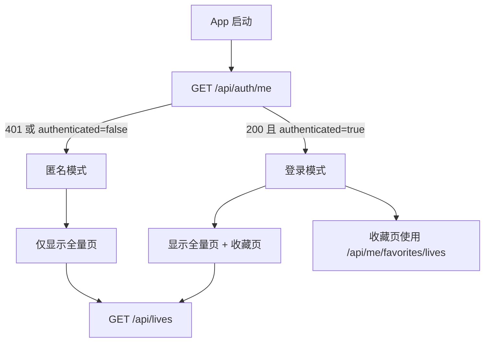
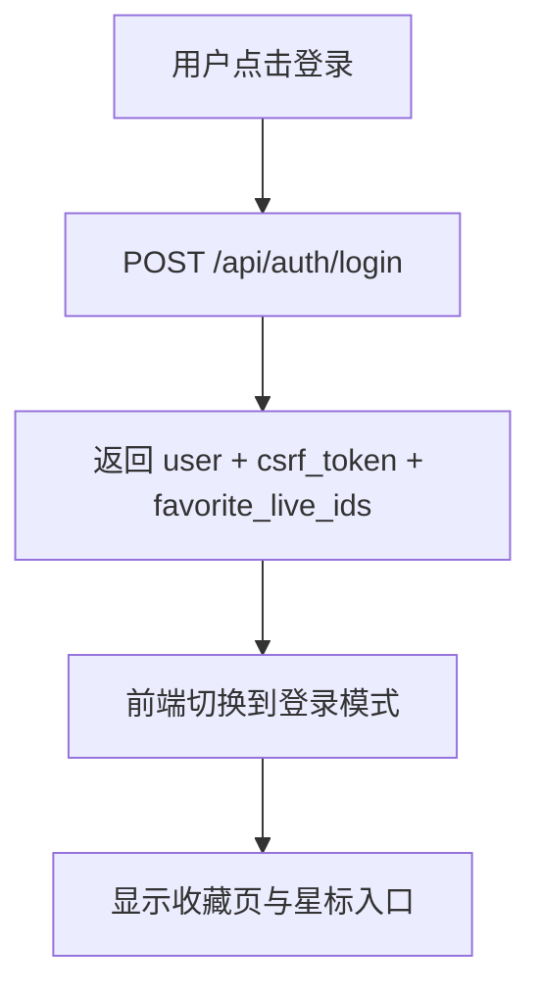
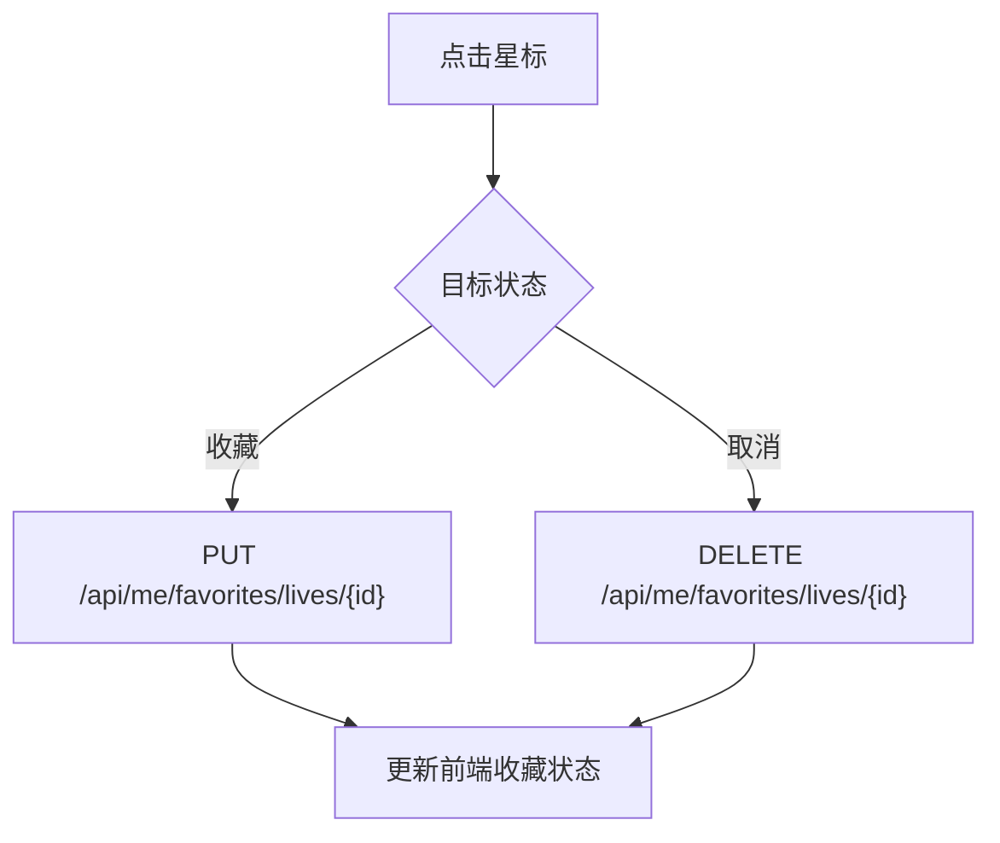

# LiveSetList 登录与收藏系统设计

本文档描述 LiveSetList 后续计划落地的登录、会话、收藏同步与后台权限方案。

注意：

- 本文档是设计与实施约定，不代表当前仓库已经全部实现
- 当前已经实现的接口行为仍以 [api.md](/D:/Code/PythonCode/5%20LiveSetList/docs/api.md) 为准
- 当前数据库迁移与角色约定仍以 [flyway.md](/D:/Code/PythonCode/5%20LiveSetList/docs/flyway.md) 为准

## 1. 设计目标

本次设计解决 4 个问题：

1. 为项目提供统一登录能力
2. 将首页“收藏”改为仅登录用户可见，并与账号绑定
3. 为后续控制台写接口提供权限控制
4. 为后续审计、会话失效、跨设备收藏同步预留结构

基于当前代码状态，推荐采用：

- 公开读接口保持匿名可访问
- 写接口和控制台入口要求登录
- 收藏功能与登录用户绑定
- 认证采用“服务端 Session + HttpOnly Cookie + CSRF Token”

## 2. 当前项目现状

当前仓库中的相关情况：

- 前端首页列表和详情接口均可匿名访问
- 前端首页当前仍保留旧版收藏 UI，尚未切换到“仅登录用户可见”的新方案
- 控制台录入界面当前仍是前端 mock，尚未接入真实写接口
- 后端认证骨架已落地：已新增用户表、会话表、认证路由和管理员初始化脚本
- 后端当前默认数据库连接仍以只读查询为主，认证相关逻辑已补充业务写连接

相关代码位置：

- 前端收藏状态实现：[App.tsx](/D:/Code/PythonCode/5%20LiveSetList/frontend/src/App.tsx)
- 前端接口封装：[api.ts](/D:/Code/PythonCode/5%20LiveSetList/frontend/src/api.ts)
- 后端接口入口：[main.py](/D:/Code/PythonCode/5%20LiveSetList/backend/app/main.py)
- 后端 live 查询路由：[lives.py](/D:/Code/PythonCode/5%20LiveSetList/backend/app/routers/lives.py)
- 后端数据库连接：[db.py](/D:/Code/PythonCode/5%20LiveSetList/backend/app/db.py)

## 3. 总体方案

### 3.1 认证模式

采用服务端 Session 模式：

- 登录成功后，由后端签发 `HttpOnly` session cookie
- 前端 JavaScript 不直接持有 session token
- 后端数据库保存 session 记录，支持主动失效和审计
- 所有写接口额外要求携带 CSRF Token

推荐 cookie：

- 名称：`live_set_list_session`
- 属性：`HttpOnly`
- 属性：`Secure`
- 属性：`SameSite=Lax`
- 路径：`/`

### 3.2 收藏模式

收藏仅对已登录用户开放：

- 未登录用户：不显示“收藏”页签，不显示星标入口
- 已登录用户：使用服务端收藏表 `user_live_favorites`
- 收藏状态不再落本地 `localStorage`

这样可以直接简化：

- 不需要匿名收藏状态
- 不需要登录时 merge 本地收藏
- 不需要维护“本地收藏”和“服务端收藏”两套来源

### 3.3 权限模式

推荐角色：

- `viewer`：可登录，可同步收藏
- `editor`：可访问控制台，可执行新增/编辑
- `admin`：可管理用户、会话、审计和高风险操作

权限边界：

- 匿名：可访问首页列表、详情、详情批量预读
- `viewer+`：可使用账号收藏
- `editor+`：可访问 `/api/admin/*`
- `admin+`：可访问用户管理类接口

## 3.4 权限控制策略

推荐采用“路由级访问控制 + 接口级鉴权 + 数据库连接分层”三层策略。

### 路由级访问控制

前端页面按是否登录和角色控制可见性：

- 匿名用户：
  - 显示“全量”页签
  - 不显示“收藏”页签
  - 不显示“控制台”页签，或显示后点击弹出登录框
- `viewer`：
  - 显示“全量”页签
  - 显示“收藏”页签
  - 不显示“控制台”页签
- `editor`：
  - 显示“全量”页签
  - 显示“收藏”页签
  - 显示“控制台”页签
- `admin`：
  - 与 `editor` 相同，并可进入后续用户管理页面

### 接口级鉴权

后端统一通过依赖注入控制权限：

- `get_current_user_optional()`：允许匿名访问
- `get_current_user()`：要求已登录
- `require_role("viewer")`：要求已登录
- `require_role("editor")`：要求具备编辑权限
- `require_role("admin")`：要求管理员权限

接口分级建议：

- 匿名可读：
  - `GET /api/lives`
  - `GET /api/lives/{live_id}`
  - `POST /api/lives/details:batch`
- 登录可用：
  - `GET /api/auth/me`
  - `POST /api/auth/logout`
  - `GET /api/me/favorites/lives`
  - `PUT /api/me/favorites/lives/{live_id}`
  - `DELETE /api/me/favorites/lives/{live_id}`
- `editor+`：
  - `POST /api/admin/songs`
  - `POST /api/admin/lives`
  - `PUT /api/admin/lives/{live_id}`
- `admin+`：
  - 后续用户管理、会话管理、审计查询接口

### 数据库连接分层

数据库权限不只依赖应用层判断，还应做账号分层：

- 读接口使用只读连接
- 收藏接口使用业务写连接
- 后台管理接口使用高权限业务写连接

这样可以降低误写风险，并和当前仓库已有的数据库角色划分保持一致。

## 4. 数据库设计

建议通过新的 Flyway migration 新增以下表。

### 4.1 `app_users`

```sql
create table app_users (
  id bigserial primary key,
  username varchar(64) not null,
  password_hash text not null,
  display_name varchar(64) not null,
  role varchar(16) not null check (role in ('viewer', 'editor', 'admin')),
  is_active boolean not null default true,
  last_login_at timestamptz,
  created_at timestamptz not null default now(),
  updated_at timestamptz not null default now(),
  unique (username)
);
```

说明：

- `password_hash` 使用 `argon2id`
- 不开放公开注册，首批用户通过初始化脚本或管理脚本创建

### 4.2 `auth_sessions`

```sql
create table auth_sessions (
  id bigserial primary key,
  user_id bigint not null references app_users(id) on delete cascade,
  session_token_hash text not null,
  csrf_token_hash text not null,
  expires_at timestamptz not null,
  last_seen_at timestamptz not null default now(),
  created_ip inet,
  user_agent text,
  revoked_at timestamptz,
  created_at timestamptz not null default now(),
  unique (session_token_hash)
);
```

说明：

- 只存 token 的哈希，不存明文
- 支持会话过期、主动注销和强制下线

### 4.3 `user_live_favorites`

```sql
create table user_live_favorites (
  id bigserial primary key,
  user_id bigint not null references app_users(id) on delete cascade,
  live_id integer not null references live_attrs(id) on delete cascade,
  source varchar(16) not null default 'manual' check (source in ('manual', 'merge')),
  created_at timestamptz not null default now(),
  unique (user_id, live_id)
);
```

说明：

- 唯一键保证收藏操作幂等
- `source` 用于区分手动收藏和登录合并

### 4.4 `audit_logs`

```sql
create table audit_logs (
  id bigserial primary key,
  user_id bigint references app_users(id) on delete set null,
  action varchar(64) not null,
  resource_type varchar(32) not null,
  resource_id varchar(64),
  payload_json jsonb,
  created_at timestamptz not null default now()
);
```

说明：

- 记录登录、登出、写操作、权限失败、收藏 merge 等行为

## 5. 后端接口设计

## 5.1 认证接口

### `POST /api/auth/login`

请求体：

```json
{
  "username": "alice",
  "password": "plain-password"
}
```

成功响应：

```json
{
  "user": {
    "id": 1,
    "username": "alice",
    "display_name": "Alice",
    "role": "editor"
  },
  "csrf_token": "csrf-plain-token",
  "favorite_live_ids": [9, 15]
}
```

行为约定：

- 校验用户名和密码
- 设置 session cookie
- 返回当前用户信息和 CSRF Token

### `GET /api/auth/me`

已登录响应：

```json
{
  "authenticated": true,
  "user": {
    "id": 1,
    "username": "alice",
    "display_name": "Alice",
    "role": "editor"
  },
  "csrf_token": "csrf-plain-token",
  "favorite_live_ids": [9, 15]
}
```

未登录响应：

```json
{
  "authenticated": false
}
```

行为约定：

- 用于前端启动时恢复登录态
- 也可用于 session 续期

### `POST /api/auth/logout`

请求头：

- `X-CSRF-Token`

成功响应：

- `204 No Content`

行为约定：

- 使当前 session 失效
- 清空 cookie

## 5.2 收藏接口

### `GET /api/me/favorites/lives`

查询参数：

- `page`
- `page_size`

成功响应：

```json
{
  "items": [
    {
      "live_id": 1,
      "live_date": "2026-03-28",
      "live_title": "BanG Dream! Unit Live",
      "bands": [1, 2],
      "url": "https://example.com/lives/1",
      "is_favorite": true
    }
  ],
  "pagination": {
    "page": 1,
    "page_size": 20,
    "total": 1,
    "total_pages": 1
  }
}
```

行为约定：

- 分页返回当前登录用户的收藏列表
- 返回结构尽量与 `GET /api/lives` 保持一致，方便前端复用

### `PUT /api/me/favorites/lives/{live_id}`

请求头：

- `X-CSRF-Token`

成功响应：

- `204 No Content`

行为约定：

- 幂等操作
- 若目标已收藏，再次调用仍返回 `204`

### `DELETE /api/me/favorites/lives/{live_id}`

请求头：

- `X-CSRF-Token`

成功响应：

- `204 No Content`

行为约定：

- 幂等操作
- 若目标本就未收藏，再次调用仍返回 `204`

## 5.3 现有读接口的扩展

### `GET /api/lives`

在现有返回项上新增：

```json
{
  "is_favorite": true
}
```

约定：

- 匿名请求：统一返回 `false`
- 登录请求：按 `user_live_favorites` 判断

### `GET /api/lives/{live_id}`

在现有详情结果上新增：

```json
{
  "is_favorite": true
}
```

## 5.4 管理接口

后续控制台真实写接口统一挂在：

- `POST /api/admin/songs`
- `POST /api/admin/lives`
- `PUT /api/admin/lives/{live_id}`

权限要求：

- `editor` 及以上

建议返回结构：

```json
{
  "ok": true,
  "item": {}
}
```

## 6. 状态码与错误码约定

统一状态码：

- `200`：查询成功
- `201`：创建成功
- `204`：无响应体的成功写操作
- `400`：业务参数错误
- `401`：未登录
- `403`：已登录但无权限
- `404`：资源不存在
- `409`：冲突，例如唯一键冲突
- `422`：请求体验证失败
- `429`：登录限流
- `500`：服务内部错误
- `504`：数据库连接或查询超时

建议错误体：

```json
{
  "detail": {
    "code": "AUTH_INVALID_CREDENTIALS",
    "message": "用户名或密码错误"
  }
}
```

建议错误码：

- `AUTH_INVALID_CREDENTIALS`
- `AUTH_SESSION_EXPIRED`
- `AUTH_CSRF_INVALID`
- `AUTH_FORBIDDEN`
- `LIVE_NOT_FOUND`
- `FAVORITE_LIVE_NOT_FOUND`
- `USER_USERNAME_CONFLICT`
- `VALIDATION_ERROR`

## 7. 前端实现约定

### 7.1 网络请求

前端统一约定：

- 所有请求使用 `credentials: "include"`
- 所有写请求带 `X-CSRF-Token`
- 登录成功后，CSRF Token 仅保存在内存态，不写入 `localStorage`

### 7.2 收藏来源切换

未登录模式：

- 不显示“收藏”页签
- 不显示星标入口
- 不保留任何本地收藏状态

登录模式：

- 收藏完全以服务端为准
- 星标操作直接调用收藏接口
- 收藏页直接使用服务端分页接口

### 7.3 页面权限

建议行为：

- 未登录时不显示“收藏”页签
- 未登录时隐藏“控制台”页签，或点击后打开登录弹窗
- 已登录但无 `editor` 权限时，显示“无权限访问控制台”
- 收到 `401` 时，前端自动清理内存登录态并回到匿名模式

## 8. 页面流转

### 8.1 启动流转



### 8.2 登录后收藏初始化



### 8.3 星标切换



## 9. 代码改造建议

后端新增建议：

- `backend/app/auth.py`
- `backend/app/routers/auth.py`
- `backend/app/routers/admin.py`
- `backend/app/routers/me.py`

后端已有文件建议改造：

- [main.py](/D:/Code/PythonCode/5%20LiveSetList/backend/app/main.py)
- [db.py](/D:/Code/PythonCode/5%20LiveSetList/backend/app/db.py)
- [lives.py](/D:/Code/PythonCode/5%20LiveSetList/backend/app/routers/lives.py)

前端新增建议：

- `frontend/src/auth/AuthProvider.tsx`
- `frontend/src/favorites/FavoritesProvider.tsx`
- `frontend/src/components/LoginDialog.tsx`

前端已有文件建议改造：

- [App.tsx](/D:/Code/PythonCode/5%20LiveSetList/frontend/src/App.tsx)
- [api.ts](/D:/Code/PythonCode/5%20LiveSetList/frontend/src/api.ts)

## 10. 实施拆分清单

下面的任务按推荐实施顺序排列。后续建议每完成一项，就单独确认一次，再进入下一项。

### 阶段 A：数据库与认证骨架

- [x] A1. 新增 Flyway migration：创建 `app_users`、`auth_sessions`、`user_live_favorites`、`audit_logs`
- [x] A2. 新增管理员初始化脚本，用于创建首个账号
- [x] A3. 后端新增认证模块骨架：密码校验、session 创建、session 校验、logout 失效
- [x] A4. 新增 `/api/auth/login`、`/api/auth/me`、`/api/auth/logout`

确认点：

- 能手动创建管理员
- 能登录、获取当前用户、退出登录
- Session cookie 和 CSRF Token 已生效

当前状态：

- Phase A 代码骨架已完成
- 认证相关测试尚未开始，本阶段还没有完成正式验收

### 阶段 B：收藏服务端化

- [ ] B1. 新增 `/api/me/favorites/lives`
- [ ] B2. 新增 `PUT /api/me/favorites/lives/{live_id}`
- [ ] B3. 新增 `DELETE /api/me/favorites/lives/{live_id}`
- [ ] B4. 改造 `GET /api/lives` 和 `GET /api/lives/{live_id}`，支持返回 `is_favorite`

确认点：

- 登录用户可跨刷新保留收藏
- `GET /api/lives` 返回的 `is_favorite` 正确
- 收藏页接口可独立分页

### 阶段 C：前端登录态与收藏切换

- [ ] C1. 前端新增 `AuthProvider`
- [ ] C2. 前端启动时接入 `/api/auth/me`
- [ ] C3. 前端新增登录弹窗或登录页
- [ ] C4. 未登录时隐藏“收藏”页签与星标入口
- [ ] C5. 登录后接入服务端收藏状态

确认点：

- 未登录用户看不到收藏入口
- 登录后收藏完全由服务端驱动
- 刷新页面后仍可恢复登录态和收藏状态

### 阶段 D：控制台权限与写接口

- [ ] D1. 未登录时隐藏或拦截“控制台”页签
- [ ] D2. 新增 `/api/admin/songs`
- [ ] D3. 新增 `/api/admin/lives`
- [ ] D4. 新增 `/api/admin/lives/{live_id}`
- [ ] D5. 写接口接入审计日志

确认点：

- 只有 `editor+` 能进入控制台
- 真实写接口可替换当前 mock
- 审计日志可记录谁做了什么操作

### 阶段 E：测试与回归

- [ ] E1. 后端单元测试：登录、登出、session、csrf
- [ ] E2. 后端集成测试：收藏增删查
- [ ] E3. 前端测试：登录态恢复、收藏来源切换、控制台权限
- [ ] E4. 回归验证：现有 live 列表、详情、详情批量预读不受影响

确认点：

- 新功能测试通过
- 现有读路径没有回归

## 11. 当前推荐的第一步

当前推荐进入阶段 B 或阶段 E：

- 若继续开发功能：
  - B1. 新增 `/api/me/favorites/lives`
  - B2. 新增 `PUT /api/me/favorites/lives/{live_id}`
  - B3. 新增 `DELETE /api/me/favorites/lives/{live_id}`
  - B4. 改造 `GET /api/lives` 和 `GET /api/lives/{live_id}`，支持返回 `is_favorite`
- 若先做验收：
  - E1. 后端单元测试：登录、登出、session、csrf

原因：

- Phase A 已经把后续收藏服务端化和控制台鉴权的认证基础铺好
- 当前最自然的分叉是继续做收藏接口，或先把认证骨架测稳
