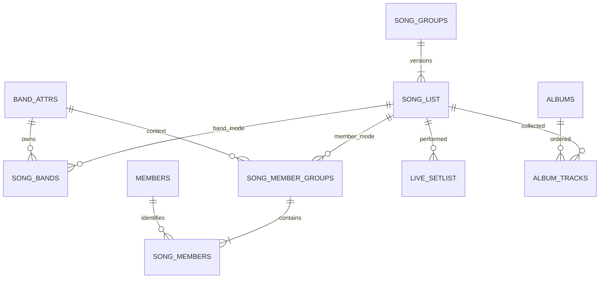

# 歌曲资料、歌曲组与专辑实现设计

## 1. 文档定位与范围

状态：待实施设计。业务规则以[歌曲资料、详情与专辑关联需求](../product/song-details-and-albums.md)为准；本文给出数据结构、接口、调用链和迁移方案，不表示业务代码、迁移或回填已经完成。

已确认的产品边界：

- 公共导航在“巡演资料”和“数据统计”之间加入“歌曲资料”。宽版左列表、右详情；左列表按歌曲组展示，不显示演奏次数；右侧切换版本，只显示所选版本次数。
- 控制台拆为“新增歌曲／歌曲管理”两个入口，复用演出新增 / 管理的交互结构；公共页与 Console 的页面结构分别设计。
- `song_id` 对应可被歌单引用的具体版本；固定合唱阵容、独立编曲与普通版属于同一歌曲组。
- 每个版本选择乐队模式或成员模式。乐队模式可包含多支乐队；成员模式保存固定成员及其对应乐队分组。
- 两种模式的现场翻唱均只比较乐队交集：任一实际出演成员所在的 setlist 乐队命中基准乐队，即不是现场翻唱。
- Instrumental 只是专辑收录标识，复用对应非 Instrumental 的 `song_id`，不产生新版本。
- 专辑发售日期为完整年月日或未知；歌曲不保存发售日期。专辑发行标识为自由文本，不拆类型、序号或碟号。
- 演奏次数按有效 setlist 记录计数。短版正常计数，仅在对应条目后标记。
- 延期调整必须指定新日期；已有歌单后不得修改演出日期，未来或取消 Live 不允许有歌单。
- 成员首次按需求文档的固定 67 人顺序编号；封面首期随包携带。

本文确定技术结构；页面具体栏宽、筛选样式及版本切换控件外观继续延后。限定 cover 的分组、旧人工翻唱标记展示等未确认事项见第 15 节，不以技术设计替代产品决定。

## 2. 当前代码基线与改造边界

| 现有入口 | 已核对的行为 | 需要适配的内容 |
| --- | --- | --- |
| [B1](../../backend/db/flyway/sql/B1__baseline_schema.sql)、[V10](../../backend/db/flyway/sql/V10__allow_same_song_name_for_different_bands.sql) | `song_list(id, song_name, band_id, is_cover)`；名称与单个 band_id 唯一；setlist 引用 song_id | 保留主键，增加组及版本字段，替换单乐队归属和唯一规则 |
| [console schema](../../backend/app/schemas/console.py) | Song 请求和响应要求单个 band_id，成员仍以名字传输 | 模式化归属、可回填状态、成员 ID 与版本消歧 |
| [console_read.py](../../backend/app/routers/console_read.py) | `/songs` 按歌名前缀和单乐队筛选，内连接 band_attrs | 继续返回具体版本候选；空归属及成员模式不能被 JOIN 丢掉 |
| [console_write.py](../../backend/app/routers/console_write.py) | 单首及批量写 song_list；Live 改期区分 correction / reschedule；歌单可新增、追加及替换 | 关系保存、日期锁定、并发校验及审计 |
| [lives.py](../../backend/app/routers/lives.py) | `_build_detail_tags` 优先人工 is_cover，否则检查单个 band 是否出演 | 独立的现场判定结果与原因；不能继续把多乐队压成一个 band_id |
| [band_history_write.py](../../backend/app/band_history_write.py) | 阵容和实际出演按姓名校验并持久化 | ID 作为人物身份，姓名保留展示用途，阵容版本和出演角色继续保留 |
| [live_status.py](../../backend/app/live_status.py)、[live_timezone.py](../../backend/app/live_timezone.py) | 公开日期阶段使用访问者时区；物理场馆使用 IANA 时区，ONLINE 的已公布时间携带偏移 | 固定演出时区下的歌单有效性校验，与公开展示状态分开 |
| [App.tsx](../../frontend/src/App.tsx) | 手写路径解析、TabKey 和 AppHistoryState，未使用 React Router | 扩展现有导航历史，不额外引入路由库 |
| [api.ts](../../frontend/src/api.ts)、[queryCache.ts](../../frontend/src/cache/queryCache.ts) | 统一请求、LRU 缓存和请求合并 | 增加歌曲组、版本和专辑类型及缓存失效 |

新歌曲页的“按版本计次”不直接删除既有全站统计的 live_count。Catalog、Tour、Live 等引用必须支持新归属结构，但它们的统计分组口径保持既有契约，另有需求时再修改。

## 3. 概念模型与 ID 规则



两条归属分支在同一版本上互斥。迁移期可以两者都为空；回填完成后必须有且仅有一条非空分支。

| 标识 | 含义 | 稳定性 |
| --- | --- | --- |
| group_id | 一首歌的共同身份，供左列表展示 | 合组不改已有 song_id；不按同名自动合组 |
| song_id | 歌单与专辑实际关联的版本 | 延续当前 song_list.id，不因新建歌曲组重新编号 |
| member_id | 自然人的全局身份 | 同人在不同乐队共用，补录不重排 |
| album_id | 一份专辑资料 | 名称相同不自动合并 |
| album_track_id | 一次收录关系 | 同一专辑可多次指向同一 song_id |
| setlist_id | 一次独立演奏记录 | 统计按记录计次，不按 Live 去重 |

`group_name` 是组的标题；`song_name` 保留现有具体条目的名称，避免迁移时改写历史名称；`version_label` 是“普通版”“三乐队合唱版”等可选自由文本。名称相同既不等于同组，也不等于同一个版本。

## 4. 数据库结构

以下是目标结构说明，不是可直接执行的 Flyway 文件。字段名可在实现时随项目命名规范微调，语义及约束不得改变。

### 4.1 歌曲组与具体版本

**新增 `song_groups`**

| 字段 | 类型及约束 | 用途 |
| --- | --- | --- |
| id | integer identity，PK | group_id |
| group_name | text，非空非空白 | 列表标题；不全局唯一 |
| revision | bigint，非空，初始 1 | 管理端并发编辑校验 |

**扩展 `song_list`**

| 字段 | 类型及约束 | 用途 |
| --- | --- | --- |
| id | 保留现有 integer PK | song_id |
| song_name | 保留现有字段，非空白 | 版本对应的歌曲名称 |
| group_id | integer FK → song_groups | 扩展迁移填充后非空 |
| version_label | text，非空，默认空字符串 | 空字符串表示尚无附加版本标识，不自动认定为原版 |
| version_order | integer > 0 | 组内切换顺序，不是专辑曲序 |
| owner_mode | text，`bands` / `members`；迁移期可空 | 归属模式 |
| revision | bigint，非空，初始 1 | 版本及其子关系的并发编辑校验 |
| band_id | 扩展阶段保留旧列，允许空 | 历史兼容证据；最终删除 |
| is_cover | 暂保留旧列 | 历史人工属性，不作为新现场判定输入 |

组内唯一规则设计：

- `UNIQUE(group_id, version_order)`，可延迟到事务结束检查，便于交换顺序。
- `UNIQUE(group_id, version_label)`；写入先 trim，空标识在一组内最多一个。第二个版本如果未能消歧，要求补充版本标识；这是建议的管理校验规则。
- 不把成员数组或乐队数组的展示顺序纳入身份。不以旧 `(song_name, band_id)` 约束继续限制多乐队、成员模式。
- 同样归属可以有不同编曲版本，因此不对“组＋归属集合”单独设唯一键。
- 组至少含一个版本：新建组与首个版本同事务完成；运行时不提供空组保存和删除最后版本的入口。组重分配后清理空组，不留下公开空组。
- 版本冲突返回 409，不能用名称冲突自动合并已有歌单或专辑关系。

组管理和版本迁移按 group_id 升序加锁，再锁 song_id；改组只修改版本的 group_id / 顺序，不更新 live_setlist.song_id。以 `/songs/{song_id}` 发出的链接因此继续有效。删除有歌单或专辑引用的版本使用 RESTRICT，不级联删除业务记录。

### 4.2 乐队模式

`song_bands(song_id, band_id, display_order)`：

- PK `(song_id, band_id)`，分别引用 song_list / band_attrs。
- band_id > 0；`0 / Other bands` 不能成为未知归属的占位值。
- `UNIQUE(song_id, display_order)`，顺序为正整数。
- 删除版本时仅可级联清理本表关系；删除乐队使用 RESTRICT。
- 两支乐队的顺序调整只改变展示，不改变翻唱结果。

### 4.3 成员模式

采用关系表存储，JSON 只作 API 交换，确保 ID 引用可验证。

| 表 | 字段与关键约束 |
| --- | --- |
| members | `id integer identity PK`、`display_name text NOT NULL`、`revision bigint`；姓名非空白但不唯一 |
| song_member_groups | `song_id, band_id, display_order`；PK `(song_id, band_id)`；组内乐队与顺序去重，band_id > 0 |
| song_members | `song_id, band_id, member_id, display_order`；FK `(song_id, band_id)` → song_member_groups；member_id FK → members |

本设计先按需求文档的去重建议采用 `PRIMARY KEY(song_id, member_id)`，同一歌曲版本中同一人选一次；`UNIQUE(song_id, band_id, display_order)` 维护组内顺序。若未来确实需要同一个人在同一版本下同时归到多个乐队，应单独确认并改用三列键，不能在当前表中悄悄重复人物。

每个成员分组必须至少有一人；对应 band_id 是创建版本时固定保存的上下文，参与现场翻唱判定，不能根据成员当前所在乐队实时推导。候选可利用历史阵容提供，但不强制成员必须仍在当前阵容内，否则无法记录已离队人员或历史合作。

### 4.4 专辑与收录

| 表 | 字段 | 约束 |
| --- | --- | --- |
| albums | `id integer identity`、`album_name text` | PK；名称非空白，不全局唯一 |
| albums | `release_label text NULL` | 如 10th single；trim 后空串归一为 NULL，不解析或枚举 |
| albums | `release_date date NULL` | NULL 表示未知；API 只接受 `YYYY-MM-DD` 或 null |
| albums | `cover_path text NULL` | 站内资源路径，不存 Base64、本机路径或用户任意 URL |
| albums | `revision bigint NOT NULL DEFAULT 1` | 包含曲目关系的编辑版本 |
| album_tracks | `id bigint identity PK`、`album_id`、`song_id` | 两个外键；删除歌曲 RESTRICT，删除专辑需先显式处理曲目 |
| album_tracks | `track_order integer > 0`、`edition_label text NULL` | 专辑内排序；Instrumental 标识位于 edition_label |

`UNIQUE(album_id, track_order) DEFERRABLE INITIALLY DEFERRED`；不设 `(album_id, song_id)` 唯一限制。调整顺序时锁专辑，提交完整顺序，在一个事务内更新；缺项、重复项、跨专辑曲目 ID 均拒绝。

普通版收录和 Instrumental 收录分别占一条 album_tracks，但它们的 song_id 相同。点击任意一条均跳转该 song_id。edition_label 不参与现场版本选择、统计或歌曲组划分。

歌曲详情按 album_id 聚合关联专辑，避免同张专辑因普通 / Instrumental 两条收录重复显示两张封面。专辑曲目详情仍返回完整两条及各自 track_order；歌曲详情不显示曲序。

### 4.5 跨表完整性

不能用普通 CHECK 查询子表来保证归属完整性。采用本行 CHECK / FK / UNIQUE，加锁和可延迟约束触发器组合；PostgreSQL 对跨表 CHECK 的限制见[官方约束文档](https://www.postgresql.org/docs/current/ddl-constraints.html)。

| owner_mode | song_bands | song_member_groups / song_members | 合法阶段 |
| --- | --- | --- | --- |
| NULL | 必须空 | 必须空 | 仅迁移回填期 |
| bands | 至少一行 | 必须空 | 所有阶段 |
| members | 必须空 | 至少一组，每组至少一人 | 所有阶段 |

具体约束方案：

1. 所有归属关系写入先锁 song_list 父行。子表触发器也锁相同父行，避免绕过 API 的并发子表修改产生写偏差。
2. song_list 及三张归属表的 INSERT / UPDATE / DELETE 均安排归属检查；检查最终事务状态。变更外键时覆盖 OLD / NEW 两个父 ID，按升序锁定。
3. 使用 AFTER ROW 的可延迟约束触发器，不用 WHEN 中的子查询提前判断非空。允许一个事务内“先删除旧关系，再写新关系”，不允许提交中间空状态。参见[CREATE TRIGGER](https://www.postgresql.org/docs/current/sql-createtrigger.html)。
4. 回填期函数允许 NULL＋全部空；收紧迁移替换检查函数并增加 owner_mode NOT NULL。不能仅靠前端开关或环境变量永久绕开数据库约束。
5. 运行时角色没有禁用触发器、修改 schema 或 TRUNCATE 主数据的权限。备份恢复后执行完整性审计，不能因恢复时触发器未运行而跳过验证。

保存任何父实体及子关系只增加一次 revision；独立修改子表也必须经过统一服务入口并锁父对象。普通资料更新不允许更换固定归属；修正归属通过带原因的显式纠错请求处理。

### 4.6 索引

新增前核对现有索引，避免重复创建：

- `song_list(group_id, version_order, id)`，由唯一顺序索引覆盖的前缀不再重复。
- `song_bands(band_id, song_id)`、`song_member_groups(band_id, song_id)`，用于归属筛选。
- `song_members(member_id, song_id)`，用于成员影响预览和引用检查。
- `album_tracks(song_id, album_id)`，用于版本关联专辑；专辑内顺序由唯一索引支撑。
- `live_setlist(song_id, live_id, absolute_order, id)`，用于版本次数和歌单读取。
- members 的姓名普通索引用于候选查询，不以姓名作为身份唯一键。

歌曲小于 500 首、专辑小于 200 张时，先复用现有文本规范化及参数化查询，不新增全文搜索服务或物化计数表。性能判断依据实际查询计划，不为小数据量预先引入额外基础设施。

## 5. 成员 ID 与历史记录衔接

### 5.1 固定初始映射

唯一名单来源是[需求文档 8.1](../product/song-details-and-albums.md#81-成员身份与固定初始顺序)。按其中顺序写入 1–67；第一批完成后，将 identity / sequence 调整到当前最大 ID 之后。编号不按数据库查询自然顺序、乐队 ID 或 Live 日期生成。

首次回填有明确前置条件：目标 members 为空，或每个既有 ID 与预期人物一致；发生占用冲突即停止。重复执行必须验证现有映射相同，不允许 ON CONFLICT 后无条件覆盖姓名。

名字采用当前库内日文 / 拉丁文写法；中文描述只用于确认映射。CRYCHIC 不新增重复人物，sumimi 的佐々木李子和 RAS 的大塚紗英复用已有 ID。同名人员未来仍可不同 ID，因此不能添加 `UNIQUE(display_name)`。

### 5.2 现有阵容和实际出演

为 `band_lineup_version_members`、`live_setlist_band_performance_members` 增加可空 member_id FK：

1. 回填期保留 member_name、display_order、appearance_role 和现有历史阵容上下文，不批量改写出演事实。
2. 用人工审核的“原姓名＋必要的乐队 / 阵容上下文 → member_id”映射填充；无法唯一映射的项单独列出，不模糊匹配相似姓名。
3. 增加 `(lineup_version_id, member_id)`、`(setlist_id, band_id, member_id)` 的唯一约束；成员 ID 完整后，以它们替换姓名构成的主键。NULL 过渡约束不能被当成最终完整性。
4. member_name 可保留为历史显示快照；更新 members.display_name 不自动改写过去的快照。API 同时返回 member_id 和展示名，比较、去重使用 ID。
5. 新增阵容及歌单成员选择器提交 ID；后端从明确 ID 生成展示快照，不能信任客户端传来的名字用于身份匹配。

`live_attrs.event_attendees` 当前还有活动参加者名字，与逐曲出演不是同一对象。本期不得用它参与歌曲翻唱计算。设计建议活动参加者接口增加可空 member_id，以审核映射衔接；旧 JSON 可暂作姓名快照保留，不把当前资料重构扩展成活动参加者存储层重写。

翻唱只需要 setlist 的实际 band_id，已知 band_id 的可靠出演记录不必等待人物 ID 全部回填后才能判定。成员 ID 是人物管理和版本基准的基础，不是把判定改回人物集合比较的理由。

## 6. 现场翻唱与演奏次数

### 6.1 统一计算函数

新增纯函数 `classify_song_performance(owner_band_ids, performer_band_ids, completeness)`，由 Live 详情和歌曲关联歌单共用。成员模式的 owner_band_ids 来自固定成员分组，而非成员当前所属乐队。

```text
基准未确认                         -> unknown(owner_pending)
任一已记录实际乐队命中基准         -> original(band_overlap)
未命中，且现场资料不足             -> unknown(performers_incomplete)
未命中，且现场资料完整             -> cover(no_band_overlap)
```

这里 original 仅表示“本次演奏不是现场翻唱”，不声称它是作品原作者或最初发行者。

P 的来源是 `live_setlist_band_performance_members` 中该 setlist 的 band_id 去重集合，包括已记录的 guest / support；不能用 Live 默认乐队、event_attendees、当前阵容或全部历史任职推导 P。只有乐队父记录却没有实际成员的异常数据不能单独证明“有一位成员出演”。

返回内部原因，API 建议使用：

```json
{
  "classification": "original",
  "reason": "band_overlap",
  "matched_band_ids": [1]
}
```

旧人工 is_cover 独立保留，不用 `is_cover OR 自动结果` 代替本规则。原 `_build_detail_tags` 的人工优先路径要显式改造；旧人工标签最终如何对外展示尚未确认，不预先更名或移除现有展示。

### 6.2 次数与关联歌单查询

统一定义有效歌单集合 E：Live 未取消，按固定演出时区不在未来，且历史延期 / 时区异常已可确定有效安排。某版本次数为 E 中 song_id 相同的记录数。归属待回填或翻唱 unknown 不影响有效演奏的计次。

查询顺序：

1. 筛选有效 Live，与 live_setlist 组成基础行，每行只含一个 setlist_id。
2. 在基础行上按 song_id 聚合计数，或按目标 song_id 查询关联歌单。
3. 分页后再批量读取实际出演乐队和成员，不能先 JOIN 成员再 COUNT(*)。
4. album_tracks 单独查询；封面、专辑重复收录、多人出演均不能放大演奏次数。

关联歌单建议按 `live_date DESC, live_id DESC, absolute_order ASC, setlist_id ASC` 稳定排序；同 Live 两条同曲保留两行。年份筛选作用于关联歌单列表；详情主次数始终是该版本全部有效演奏次数，分页 total 是当前过滤结果，字段不得混用。

一次详情读取中的次数、歌单首屏与 total 使用同一快照；可采用单次 CTE 查询，或只读 REPEATABLE READ 短事务。分开的分页 HTTP 请求可能看到后续编辑后的状态，返回明确 total，不承诺跨请求冻结快照。

## 7. Live 日期有效性与写入锁

### 7.1 固定演出日期基准

新增内部 `live_setlist_policy` 服务及对应 SQL 判定入口。公开页面仍可按访问者时区呈现日期阶段；服务端写入和歌曲计数不得依赖请求中的访问者时区。

建议优先级：物理 / 未公开场馆的 venue.timezone_id → ONLINE 已公布 timetz 中的固定偏移。无可靠时区时返回 `schedule_basis_unknown`，不得默认使用服务器本地时间。无场馆或 ONLINE 未公布时刻的历史数据需先审计；这部分最终回退规则属于第 15 节的实施前边界。

只存在可靠日期和时区即可判断“当日”；不要求开演时间、完演时间或跨日后才录歌单。SQL 与 Python 使用一致的 as_of 时刻和日期算法；单元测试可传入时刻，不引入生产端任意绕过日期的参数。

### 7.2 事务流程

```text
Console 保存歌单
  -> editor+ / session / CSRF
  -> SELECT Live FOR UPDATE
  -> 获取当前日期和状态，判断可写
  -> 校验 song_id、阵容上下文、实际出演
  -> 同事务写 setlist 与成员关系、审计
  -> 提交后清理相关缓存
```

Live 更新也先锁同一 Live 行，再检查歌单是否存在：

- 有歌单且 live_date 改变：409 `live_date_locked`；改成另一个过去日期也拒绝。
- 有歌单且目标为 cancelled：409 `live_has_setlist`。
- 新增 / 替换 / 追加歌单时为未来或取消：409 `live_not_performable`。
- 延期必须提供新的明确日期；旧值不变、缺少新日期不能作为有效延期。是否允许同日时刻调整继续沿用 correction / 日程字段分类，不把全部资料字段锁死。
- 修改场馆或 ONLINE 时间偏移若改变有效日期基准，必须重新校验已有歌单的不变量，不能通过换时区绕过日期锁。

删除 / 替换歌单同样锁 Live，不因“删除后再插入”短暂为空而允许并发修改日期。多 Live 操作按 ID 升序锁定。与父行锁配套的数据库触发器防御直接关系写入，基础权限不开放绕过入口。行锁语义参考[PostgreSQL 显式锁](https://www.postgresql.org/docs/current/explicit-locking.html)。

日期有效性是运行时规则，不写为带 CURRENT_DATE 的普通 CHECK。时区资料变更可能影响已有演出的有效性，场馆时区修改入口也需影响预览和同一规则校验；不能只守住 Live 页面。

### 7.3 既有异常

实现前只读列出未来 / 取消仍有歌单、延期未更新日期、无可靠时区的记录。禁止自动删除；修正由独立回填处理。未知与明确错误分开报告，不在 API 中把 unknown 当 0 次且无任何维护线索。

新公开歌曲统计以规则可确定的数据为准；涉及无法确定有效性的版本，内部质量报告给出受影响 song_id / live_id，完成整理后再开放完整统计，不以猜测日期填平历史数据。

## 8. API 设计

### 8.1 公共只读接口

新增 `routers/songs.py`、`schemas/songs.py`，由 main.py 注册；使用 get_db_connection。下面的路径及参数是实现设计，尚非现有 API。

| 接口 | 主要输入 | 输出 / 行为 |
| --- | --- | --- |
| `GET /api/song-groups` | q、band_id、owner_mode、page、page_size、sort | 每项一个歌曲组；无演奏次数；匹配组内版本后对组去重 |
| `GET /api/song-groups/{group_id}` | group_id | 组标题、按 version_order 的版本候选，不跨版本合计次数 |
| `GET /api/songs/{song_id}` | song_id | 所属组、具体版本、归属、revision、全部演奏次数及关联专辑 |
| `GET /api/songs/{song_id}/performances` | page、page_size、year | 每条 setlist 一项，含位置、短版、现场判定、实际出演、Live 链接资料 |
| `GET /api/albums/{album_id}` | album_id | 最小专辑资料与按 track_order 排序的收录条目，供关联专辑内容使用 |

q 复用 [song_lookup.py](../../backend/app/song_lookup.py) 及其共享标点配置，匹配组名或版本歌名；不新增不同的正则规范化规则。组列表分页在 DISTINCT group_id 后执行，不能先分页版本再客户端去重。

公共目录建议使用规范化后的包含匹配，现有 Console 候选维持前缀匹配；两者只区分匹配位置，不区分标点等价规则。SQL 中 q、年份和 ID 均参数化，LIKE 的 `%` / `_` 作为用户文本转义。按名称排序时用规范化组名加 group_id 作为稳定次序，不能依赖数据库未指定顺序。

band_id 过滤的建议契约：匹配任一版本的固定 band_id（乐队模式的 song_bands 或成员模式的分组乐队）；返回匹配版本 ID，选组时优先选匹配版本。owner_mode 与 band_id 必须在同一个版本上满足，不能分别命中组内两个版本后误返回。

页面筛选是否向用户开放全部参数继续由后续 UI 决定。技术默认建议 page_size=20、最大 100、sort=name；确定页面排序前不添加隐含组总次数排序。空集合返回 200 和空 items；ID 类型或范围非法为 422，合法 ID 对应的实体不存在为 404。

### 8.2 归属响应

使用判别联合；空值只能表示迁移未确认，不以空数组伪装已确认模式。

```json
{
  "song_id": 1001,
  "group_id": 101,
  "song_name": "示意歌曲",
  "version_label": "三乐队合唱版",
  "version_order": 2,
  "revision": 1,
  "ownership": {
    "mode": "bands",
    "bands": [
      {"band_id": 1, "band_name": "Poppin'Party"},
      {"band_id": 2, "band_name": "Afterglow"},
      {"band_id": 4, "band_name": "Roselia"}
    ]
  },
  "performance_count": 0,
  "albums": []
}
```

成员模式替换 ownership 为 `{"mode":"members","groups":[{"band_id":1,"band_name":"Poppin'Party","members":[{"member_id":1,"display_name":"愛美"}]}]}`；迁移未确认为 `{"mode":null,"status":"pending"}`。上例为接口结构示意，不是真实数据库记录。

Pydantic 与 TypeScript 必须同步声明三种结构；客户端不读取虚构的单值 band_id。歌单实际出演使用单独的 performers 字段，禁止把它装进 ownership。

### 8.3 管理接口

延续 `/api/console` 的 editor+、会话、CSRF、审计和异常转换：

| 接口 | 职责 |
| --- | --- |
| `GET /api/console/songs` | 具体版本候选及分页；用于歌单选曲，不改成组候选 |
| `GET /api/console/songs/{id}` | 歌曲管理加载完整版本、归属关系、group_id 及组 / 版本 revision，不以候选摘要代替编辑详情 |
| `POST /api/console/song-groups` | 新建歌曲组及首个版本，同事务 |
| `PUT /api/console/song-groups/{id}` | 组标题、版本顺序与 revision 校验 |
| `POST /api/console/songs` | 为已有组新增版本，明确归属或迁移期待回填 |
| `PUT /api/console/songs/{id}` | 普通资料修改；不接受普通编辑偷偷更换固定归属 |
| `PUT /api/console/songs/{id}/ownership` | 显式纠错 / 回填，expected_revision、reason、完整目标归属 |
| `POST/PUT /api/console/albums[/{id}]` | 最小专辑资料；完整日期或 null |
| `PUT /api/console/albums/{id}/tracks` | 完整曲目关系及顺序替换；保留已有 album_track_id |
| `GET/POST/PUT /api/console/members[/{id}]` | 稳定成员候选与资料；UI 挂在乐队管理下 |

组重分配作为显式纠错服务操作，锁新旧组及版本，检查唯一性、版本顺序和空组，记录原组与目标组；不通过普通改名自动触发。是否开放专门管理按钮后续决定。

写入 ownership 的形状采用 `mode + band_ids` 或 `mode + member_groups[{band_id, member_ids}]`，顺序来自数组；未知 member_id / band_id 拒绝，重复 ID 明确报错。迁移期未确认只能提交整体 null；双模式、半空成员组始终拒绝。

expected_revision 必须匹配，否则 409 `revision_conflict`，返回重新读取提示，不自动覆盖他人修改。字段格式错误为 422；命名冲突及业务锁定为 409。沿用现有错误响应约定，不新增未使用的全站错误协议。

旧 `/songs:batch` 的单乐队推导按要求在回填阶段决策。框架期新归属接口与旧写入适配必须同时就绪：旧请求可通过限定过渡适配保留旧 band_id 证据并创建待回填记录，但不得静默宣布其已确认归属；如果适配尚未实现，不开放新模型写入，不能让旧端直接写出缺组记录。

### 8.4 分页与组响应示例

公共列表沿用项目的 `items + pagination` 结构；Console 候选继续沿用它现有的扁平分页结构，避免无关接口重排。下面的 ID、标题和次数仅为契约示例。

`GET /api/song-groups?q=示意&page=1&page_size=20`：

```json
{
  "items": [
    {
      "group_id": 101,
      "group_name": "示意歌曲",
      "version_count": 2,
      "matched_song_ids": [1000, 1001]
    }
  ],
  "pagination": {"page": 1, "page_size": 20, "total": 1, "total_pages": 1}
}
```

这里 total 为歌曲组数量，version_count 只表示资料版本数，不是演奏次数。无筛选时 matched_song_ids 包含该组全部版本；筛选命中的版本按 version_order 排序。建议越界页返回空 items 和真实 total，不把请求偷偷改成最后一页。

`GET /api/song-groups/101`：

```json
{
  "group_id": 101,
  "group_name": "示意歌曲",
  "revision": 3,
  "versions": [
    {"song_id": 1000, "song_name": "示意歌曲", "version_label": "", "version_order": 1},
    {"song_id": 1001, "song_name": "示意歌曲", "version_label": "三乐队合唱版", "version_order": 2}
  ]
}
```

组响应不携带全组次数，也不加载全部版本的歌单；次数只在当前版本详情读取。组标题和版本名称必须作为文本渲染，不当成 HTML。

### 8.5 演奏与专辑响应示例

`GET /api/songs/1001/performances?page=1&page_size=20&year=2026`：

```json
{
  "song_id": 1001,
  "items": [
    {
      "setlist_id": "00000000-0000-4000-8000-000000000001",
      "live_id": 2001,
      "live_title": "示意 Live",
      "live_date": "2026-01-01",
      "absolute_order": 1,
      "segment_type": "M",
      "sub_order": 1,
      "is_short": true,
      "comment": null,
      "performance_classification": {
        "classification": "original",
        "reason": "band_overlap",
        "matched_band_ids": [1]
      },
      "performers": [
        {
          "band_id": 1,
          "band_name": "Poppin'Party",
          "members": [{"member_id": 1, "member_name": "愛美", "appearance_role": null}]
        }
      ]
    }
  ],
  "pagination": {"page": 1, "page_size": 20, "total": 1, "total_pages": 1}
}
```

setlist_id 原样返回现有 UUID。member_id 在历史人物回填完成前可为 null，member_name 则保留实际记录名称；不因 ID 尚空丢掉整条出演。段落位置复用 segment_type / sub_order / absolute_order，不把编号格式硬编码为仅 M 段。

`GET /api/albums/501`：

```json
{
  "album_id": 501,
  "album_name": "示意专辑",
  "release_label": "10th single",
  "release_date": null,
  "cover_path": null,
  "revision": 1,
  "tracks": [
    {"album_track_id": 9001, "song_id": 1000, "song_name": "示意歌曲", "track_order": 1, "edition_label": null},
    {"album_track_id": 9002, "song_id": 1000, "song_name": "示意歌曲", "track_order": 2, "edition_label": "Instrumental"}
  ]
}
```

专辑响应不派生歌曲首发日期；null 日期与无封面独立。`GET /api/songs/{id}` 的 albums 数组只返回专辑摘要，不嵌入 track_order；需要专辑完整曲目时再请求本接口。

### 8.6 写入请求与事务边界

新建歌曲组及第一个版本：

```json
{
  "group_name": "示意歌曲",
  "first_version": {
    "song_name": "示意歌曲",
    "version_label": "",
    "ownership": {"mode": "bands", "band_ids": [1]}
  }
}
```

新组的首个 version_order 由服务端设为 1；为已有组添加版本需要 group_id、expected_group_revision 和版本资料，在锁组后追加到末尾。创建成功返回 HTTP 201、`ok` 及已创建实体的 ID / revision；失败不得留下孤立空组。

成员模式归属纠错 / 回填请求：

```json
{
  "expected_revision": 2,
  "reason": "按已核对资料补齐固定成员归属",
  "ownership": {
    "mode": "members",
    "member_groups": [
      {"band_id": 1, "member_ids": [1, 3]},
      {"band_id": 6, "member_ids": [30, 31]}
    ]
  }
}
```

处理顺序为“校验请求形状 → 开事务 → 锁 song_list → 比较 revision → 校验全部引用 → 保存旧归属审计快照 → 完整替换关系和模式 → revision 加一 → 审计 → 提交”。约束触发器检查的是提交后的最终组合。捕获冲突必须覆盖事务提交阶段，不能只捕获 INSERT / UPDATE；延迟约束可能在离开连接事务上下文时才报错。

普通 `PUT /songs/{id}` 只接受 song_name、version_label、expected_revision；组内顺序由组操作更新，归组及归属由纠错服务更新。请求采用 extra=forbid，避免客户端传来的旧 band_id 被忽略后显示“保存成功”。

专辑曲目整体保存：

```json
{
  "expected_revision": 1,
  "tracks": [
    {"album_track_id": 9001, "song_id": 1000, "edition_label": null},
    {"album_track_id": null, "song_id": 1000, "edition_label": "Instrumental"}
  ]
}
```

数组顺序映射为连续 track_order；已有 ID 保留，新条目分配 ID，遗漏旧条目视为解除收录关联。界面保存前显示差异，接口拒绝其他专辑的曲目 ID。锁 albums 父行、校验 revision 后，完整变更和专辑 revision 加一同事务完成；解除关联不删除歌曲。

专辑资料请求采用 `album_name, release_label, release_date, cover_path`，更新增加 expected_revision。日期只接受 JSON 字符串 `YYYY-MM-DD` 或 null；拒绝数字时间戳、空字符串、仅年份 / 年月和非法日期，不能依赖宽松的 date 类型自动补全。可空文本空白归一为 null。

新成员请求仅传 display_name，不允许客户端分配正式 ID；固定 1–67 的初始化走审核后的回填，之后使用序列。任何 POST 在网络结果未知时不自动重试创建，先重新读取核对，避免重复组或专辑。

### 8.7 错误响应与失败恢复

沿用 [common.py](../../backend/app/schemas/common.py) 的 `{"detail":"..."}` 业务错误和 422 字段错误列表。本文 `revision_conflict` 等名称是服务内部原因，不意味着要在公共错误响应中新增全站 code 字段。

| 情况 | HTTP | 数据结果与用户恢复动作 |
| --- | --- | --- |
| 实体或外键目标不存在 | 404 | 不写入；重新选择有效对象 |
| 非法模式、双模式、重复 ID、部分日期 | 422 | 不写入；保留草稿并定位字段 |
| revision 不匹配 | 409 | 不覆盖；重新载入最新资料后比较草稿 |
| 组内标识 / 顺序冲突 | 409 | 事务回滚；明确修改相冲突的项 |
| 已有歌单改日期、未来 / 取消录歌单 | 409 | 原资料保持；回到符合规则的操作 |
| 查询或锁等待超时 | 504，按现有异常转换 | 不宣称成功；重新读取确认，避免盲目重复创建 |
| 其他数据库失败 | 500 | 同事务修改及审计回滚；客户端保留输入 |

成功响应在提交之后构造，缓存也只在成功后失效。关系冲突、失效的成员和失效的封面引用不能被压成“数据库一般错误”让用户猜测。数据库错误详情按项目现有日志与 API 规则处理，不把数据库连接信息返回客户端。

## 9. 前端页面与状态

### 9.1 页面组成

新增 SongArchivePage，内部拆为 SongGroupList、SongVersionDetail、SongPerformanceList、SongAlbumList。组件名称是代码组织建议，避免把所有请求和渲染堆入 App.tsx。

```text
歌曲资料（宽内容区）
┌────────────────────┬────────────────────────────────────┐
│ 搜索 / 筛选         │ 歌曲组名称                          │
│ 歌曲组 A  ← 选中    │ 版本切换                            │
│ 歌曲组 B            │ 固定归属             版本演奏次数   │
│ 歌曲组 C            │ 关联歌单（逐条、短版标记）          │
│ …                   │ 关联专辑                            │
│ 列表分页            │                                    │
└────────────────────┴────────────────────────────────────┘
```

复用项目 PageTitle、ContentState、主题变量、筛选和分页控件、Band 图标。宽度只作用于歌曲页面容器，不修改全局 content 宽度导致其他页面变宽。不恢复已删除的 HTML 示例，也不把四种草图切换放进正式产品。

左侧不出现任何版本或组的演奏次数；右侧不新增组总计、演出场数、短版统计或返场统计。详情关联专辑不显示 track_order，只有打开专辑曲目内容时使用该顺序。

具体栏宽、详情滚动方式和窄屏如何折叠继续待 UI 细化；实现时必须可键盘选择、版本切换可聚焦、异步状态可读，窄屏不能横向溢出或丢失返回列表入口。

### 9.2 URL 与选择状态

延续 App.tsx 的路径解析和 history：

- `/songs`：歌曲组目录。
- `/songs/{song_id}`：在同一框架内定位 group_id 和具体版本，来源无关。
- 左侧选组后，无过滤时优先上次选择的有效版本，再按 version_order 第一项回退；有过滤时只在 matched_song_ids 中按同样优先级选择。直接 song_id 链接不受此默认选择规则限制。版本排序为确定性回退，不声称第一项必然是原版。
- 来自 Live / 专辑 Instrumental / 巡演 / 统计的 song_id 优先，不能被组默认版本覆盖。
- 用户主动切换歌曲或版本写入 history；筛选恢复和初始化使用 replaceState，避免制造无意义历史。
- AppHistoryState 保存查询、页码、selectedGroupId、selectedSongId 和来源上下文；popstate 恢复对应状态，不在恢复过程中再 pushState。
- 直达版本不在左侧当前分页或筛选结果中时，保持该版本详情和来源筛选，不伪造一条筛选命中记录；列表选中状态按真实可见结果呈现。

### 9.3 请求与竞态

用户选组 → 获取组版本 → 选 song_id → 获取版本详情和关联歌单首屏。直接 song_id 入口先取详情确定 group_id，再补版本候选和目录。

每次选择变化增加请求代号或使用 AbortController；只有当前 song_id / 查询键的响应可以更新界面。切换版本同步清空旧的待显示关联歌单，不出现“新标题＋旧版本次数”。列表加载失败不清掉已成功选中的详情；关联歌单分页失败在本区域重试。

### 9.4 选择与异常状态表

| 操作 / 状态 | 左侧 | 右侧 |
| --- | --- | --- |
| 首次进入 /songs | 加载组目录，不展示次数 | 等待明确选中；是否自动选首组在 UI 细化时决定 |
| 点击一个组 | 保持筛选和页码，选中该组 | 依据版本优先级加载，显示对应加载态 |
| 切换版本 | 仍选中同组，不改目录分页 | 次数、归属、歌单、专辑统一切换 |
| 搜索无结果 | 空结果及现有筛选 | 保留已选的直达详情，不伪造命中项 |
| song_id 不存在 | 可继续浏览目录 | 404 状态，不回落到另一首歌冒充成功 |
| 版本归属待回填 | 不隐藏该歌曲组 | 归属未确认；有效演奏次数仍可展示 |
| 版本无演奏 | 保留正常版本 | 次数为 0、歌单为空，不当作请求失败 |
| 无关联专辑 / 日期未知 | 不影响目录 | 分别表达无关联与日期未知，不表达“未发行” |
| 浏览器返回 Live | 恢复来源上下文 | 恢复原 Live 逐曲展开位置，不跳到全站首页 |

用户主动改筛选时是否清空选择可在视觉交互阶段确定；接口和组件必须同时支持“左侧无命中但直达详情仍有效”，避免把页面筛选误当成实体访问权限。

## 10. Console 与兼容读取

### 10.1 新增与管理两个页面

当前 [ConsoleInsertPanel.tsx](../../frontend/src/components/ConsoleInsertPanel.tsx) 的演出导航已有 `live_create / live_edit`，共同使用 [LiveAdminSection](../../frontend/src/components/console/LiveAdminSection.tsx) 的 `variant="create" / "edit"`；歌曲目前只有 `song` 入口，新增、选中修改和搜索同处 [SongAdminSection](../../frontend/src/components/console/SongAdminSection.tsx)。目标是拆分页面入口和状态，复用公共字段组件，不复制两套表单逻辑。

建议将 [ConsoleMode](../../frontend/src/components/console/types.ts) 扩展为 `song_create / song_edit`，在“歌曲”分组配置 create / manage 两个入口，显示“新增歌曲／歌曲管理”。旧 `song` 内部入口及调用点统一迁移到 song_edit；不额外新增公共站点导航项，也不要求独立浏览器窗口或新路由库。

组件可继续使用 `SongAdminSection variant="create" | "edit"`，抽出共享 SongFields / SongOwnershipFields；外层负责两页不同的工具栏、动作区和操作记录。复用演出页的管理工具栏、表单字段、确认弹窗和操作记录样式，不复制演出专用的日期、场馆或待补排期内容。

| 行为 | 新增歌曲 | 歌曲管理 |
| --- | --- | --- |
| 进入页面 | 重置选中 ID 和原始快照，显示新增表单 | 显示查询与候选选择，未选中不显示编辑区 |
| 资料目标 | 新建歌曲组及首个版本，或向已有组新增版本 | 修改已加载的具体 song_id；组级操作明确属于哪个 group_id |
| 主要控件 | 组归属、歌曲名称、版本标识、固定归属 | 查询、筛选、分页、版本候选，加载后显示相应字段 |
| 清理动作 | 清空数据 | 恢复原值，不取消当前选中对象 |
| 提交动作 | 提交插入 | 保存修改；未选中、无修改或资料不合法时禁用 |
| 确认内容 | 即将创建的歌曲组 / 版本及归属摘要 | 相对服务端原始快照的差异，复用 UpdateDiffTable |
| 保存成功 | 保持新增模式；按“提交后清空”选项处理输入 | 保持当前版本，刷新原始快照和 revision |
| 保存失败 | 保留输入，不记入新增成功记录 | 保留选中对象和草稿，不清掉差异 |
| 操作记录 | 仅显示新增记录 | 仅显示修改记录 |

“提交后清空”沿用演出新增现有选项及其默认值，不另行发明歌曲专属默认。关闭清空时可以保留录入字段辅助连续新增，但 editingSongId / originalSongPayload 必须仍为空，不能把下一次提交变成更新刚创建的 song_id。若保留的组名仍处于“新建组”模式，不自动转为已有组；再次提交前仍显示新建组确认，避免隐式改变操作语义。

### 10.2 新增歌曲流程

1. 进入 song_create，初始化独立新增草稿。明确是新建组还是为已有组添加版本；已有组候选只承担归属选择，不加载已有版本进入编辑。
2. 新建组填写 group_name；已有组保存 group_id 和 expected_group_revision。填写 song_name、version_label、乐队 / 成员模式及固定关系。
3. 迁移期可按既定规则留归属整体为空，最终收紧后拒绝；页面拆分不扩大空值权限。专辑 Instrumental 仍只在专辑收录中操作，不在此创建歌曲。
4. 点击“提交插入”打开现有风格的创建确认：明确“新组＋首个版本”或“已有组＋新版本”、歌名、版本和归属。确认过程使用固定 payload 快照；修改表单后必须重新生成确认内容。
5. 新建组调用 `POST /api/console/song-groups`，向已有组加版本调用 `POST /api/console/songs`。仅在事务提交成功后更新操作记录、缓存和候选。
6. 保持新增页，按清空选项重置或保留草稿。操作记录中的“编辑”进入 song_edit 并通过返回的 song_id 加载完整详情，不从摘要反推完整编辑数据。

### 10.3 歌曲管理流程

1. 进入 song_edit，展示歌曲查询、归属筛选、分页和版本候选；复用演出管理“先选中，再编辑”的结构。候选至少区分歌曲组、版本和固定归属，不能继续只显示“歌名＋一个乐队”。
2. 选择具体 song_id 后请求 Console 编辑详情，取得完整资料、固定关系和 revision，再建立 originalSongPayload 与编辑草稿。新增 `GET /api/console/songs/{song_id}` 编辑读取契约，不能把分页候选当成完整资料保存。
3. 已选对象移出候选当前页时，继续显示其完整标签，与普通候选相同；新候选返回不得清空选中 ID 或覆盖未保存草稿。加载失败不把一个未完整加载的版本标为可编辑。
4. 普通字段修改使用差异确认及 `PUT /api/console/songs/{song_id}`；group_name / 组内顺序使用对应组接口和组 revision，不能把它们误存入单个版本。
5. 固定归属默认只读，回填 / 纠错通过第 8 节显式入口提供原因和影响；页面拆分不意味着成员模式可以随意维护阵容变化。
6. “恢复原值”恢复当前版本最近一次成功读取或保存后的快照，保留选择。没有差异不发送 PUT；保存中禁止重复提交。
7. 成功后原地更新快照、revision、候选及修改记录；版本改名后页外选中标签同步变化。409 冲突保留本地草稿，重新读取后比较，不自动覆盖服务端。

组级和版本级编辑各持有自己的原始快照与 revision；同一确认动作不跨多个 HTTP 写请求假装原子保存。若界面需要同时编辑组标题和版本资料，应拆成明确的组操作 / 版本操作，或另设计一个原子组合接口后再提供统一提交按钮。

### 10.4 草稿、切换保护与状态组织

复用演出管理已存在的放弃修改确认流程：管理有未保存修改时，切换版本、切换到新增页或离开歌曲管理均先确认；取消则保留原页面、选中 ID、草稿和焦点，确认后才加载目标。翻候选页、修改筛选但未更换编辑对象不视为放弃草稿。

建议用互斥页面状态表达 create / edit，并分别保存新增草稿、编辑原值与编辑草稿；同一个字段组件通过 props 接收状态，不从 editingSongId 是否为空猜测提交动作。确认对象显式包含 action、目标 ID、expected_revision 和 payload 快照；切换页面、取消确认或目标变化时清理旧确认。

新增页切换时的清空 / 保留行为及未保存提醒范围沿用演出新增现行规则；不把管理页保护扩大为本次未要求的新全站离开拦截。管理页的 isDirty 应比较规范化业务值：显示顺序变化计入编辑差异，但不改变翻唱基准的集合语义。

新增记录、修改记录可共享底层列表结构，但记录中必须保留 action，页面按 action 过滤；不能像当前 insertedSongs 那样仅凭 song_id 覆盖一条记录后混淆新增与修改。导航、操作记录编辑入口、外部定位和确认回调均走统一模式切换函数，不绕过未保存保护。

### 10.5 其他资料维护与兼容读取

成员管理放在乐队管理下，但成员 ID 是全局实体：通过历史阵容查看某队人物、创建新人物或选已有跨团人物，不能在每支乐队下各自编号。已有 ID 不允许手工改号。

专辑管理维护名称、发行标识、日期和封面引用；曲目用具体 song_id 选择器维护顺序和 edition_label。添加 Instrumental 时复用已有非 Instrumental 曲目，禁止该操作调用创建歌曲接口。

必须同步清点：

| 路径 | 兼容要求 |
| --- | --- |
| Catalog 搜索、全站统计、Tour 歌曲引用 | 返回模式化归属，保留 song_id 的版本语义；不擅自合组计数 |
| Live 详情、StageTrackInspector | 实际出演和固定归属分开；增加歌曲资料入口，保留原逐曲展开 |
| Console 批量解析与歌曲匹配 | 沿用标点规范化；多候选必须人工消歧，不按第一个同名版本自动选中 |
| 旧 API band_id / band_name / cover 字段 | 新增 ownership 期间双读；只有明确单乐队旧记录可提供旧标量，多乐队和成员模式不可随便取第一个 band_id |
| 前端测试 mocks 与响应 schema | 同时覆盖 bands、members、pending，不能只改 TS 类型不改 HTTP 返回 |

旧字段兼容阶段先将会接收新数据的消费者全部适配，再开放多乐队 / 成员模式写入。待全部内部调用切换完成才删除 legacy 字段；不是保证任意旧版本客户端都能理解新模型。

旧 `song_name_band_id_key` 与 band_id 非空约束的放宽，应在 P2 兼容代码可以承接新形状、旧写入已接入统一服务后进行，并同步启用新的组内唯一约束。P1 只增加关系框架时可暂留旧约束，不提前向旧应用写入它无法读取的 NULL band_id。切换后旧 band_id 只保留原记录证据，新成员模式或多乐队版本填 NULL；不能用任取一支乐队或 0 来满足旧字段。

## 11. 缓存、权限与封面

### 11.1 缓存失效

复用 LruRequestCache 和请求合并，新增目录、组版本、版本详情、关联歌单、专辑查询键。组目录键含 q / band_id / mode / sort / page；歌单键含 song_id / year / page。

| 修改 | 失效范围 |
| --- | --- |
| 歌曲组标题、版本归组或排序 | 目录、相关组、相关 song_id 详情及引用候选 |
| 版本名称或固定归属 | 版本详情、目录候选、相关 Live 翻唱标签、关联歌单及引用展示 |
| 追加、替换、删除歌单 | 涉及版本次数及歌单、对应 Live；替换时使用旧新 song_id 并集 |
| Live 日期 / 状态 / 场馆时区 | 所有关联 song_id 的有效次数与歌单 |
| 专辑资料 / 曲目 / 封面 | 专辑及旧新引用版本的关联专辑 |
| 成员或乐队名称展示 | 归属摘要、候选及受影响详情；历史姓名快照按既有语义保留 |

初期数据量较小，可整类清缓存保证正确，不建立复杂依赖图。扩展现有 consoleLiveSync 事件或增加明确的资料变更事件，在同页和跨标签页失效；不得把 album_id 塞进 liveId 字段。

清缓存还要增加 generation：失效前发出的旧请求即使稍后成功，也不能重新写回当前缓存。已有 LRU promise 比较机制只能防止部分请求混淆，需要在新增封装中验证此场景。

### 11.2 权限与审计

公共查询使用 live_project_ro。管理写入使用现有 get_write_db_connection，仍由 editor+、session、CSRF 控制；普通收藏写账号不获得资料维护权。新表、序列、函数按现有 owner 契约归 live_project_owner，Flyway 建立授权，不修改 flyway_schema_history 所有权。

审计保存实体 ID、修改前后差异、归属模式及关系、纠错原因和操作者。批量关系更新失败整事务回滚，不记录已成功审计但数据未提交的状态。

### 11.3 封面出包

使用 `frontend/public/media/albums/<album-id>/<content-hash>.webp`，数据库存 `/media/albums/...`。静态文件随 frontend/dist 被 build_release.py 打包；一张专辑图片被所有相关歌曲共享。

首期目标约 600–800 像素、每张 80–150 KB，200 张预算约 16–30 MB；属于素材处理目标，不是实测。保持独立图片请求、懒加载和固定宽高占位，不内联进 JS 或 API。详见[需求文档封面预算](../product/song-details-and-albums.md#54-封面随包方案及体积预算)。

封面路径写入限制在预定资源前缀，拒绝 `..`、协议 URL、本机路径。新增图片先随包提供，再关联路径；改图更换 hash，不覆盖旧缓存同名文件。一个仍被数据库引用的旧 hash 不能在后续包中直接删掉。

若首期不提供 Console 上传，管理端选择或填写已随包提供的资源引用即可；上传功能不能只保存浏览器本地路径，也不能临时写入可能被下次出包替换的静态目录。

## 12. 迁移与回填顺序

实际 Flyway 版本号在实现时按仓库最新版本分配。已执行迁移不修改；不把本设计里的 P1 / P2 名称当成固定 V 编号。

| 阶段 | 结构 / 代码 | 数据及验收门槛 |
| --- | --- | --- |
| P0 契约准备 | 盘点单 band_id 读取、兼容响应和测试数据；定义新 schema / 类型 | 旧 song_id 引用、人工翻唱值、异常歌单清单可核对 |
| P1 扩展框架 | 新组、归属、成员、专辑表；可空 owner_mode；历史成员可空 ID；父行锁和互斥约束 | 每个旧 song_id 机械分配独立组及 version_order=1，不自动按名称合组；旧 band_id 留作证据 |
| P2 应用兼容 | 公共读、Console、Catalog / Tour / Live 全部识别 bands / members / pending；开放待回填框架 | 旧入口无 int(None)、内连接丢行或任取一个 band；新增歌曲均有 group_id |
| P3 人工回填 | 显式配置的迁移期录入；旧批量新增推导规则在此处理 | 67 人映射、具体歌曲归属、歌曲组、版本标识、专辑资料逐项审核；Other bands 单列 |
| P4 约束收紧 | 新迁移设 owner_mode、历史 member_id 非空；替换姓名主键；删除过渡写入入口 | 空归属、双模式、空成员组、悬空 ID、歧义映射和非法歌单均已处理 |
| P5 清理兼容 | 确认所有引用迁移后删除 song_list.band_id 等过渡字段；旧 is_cover 依产品结论处理 | 新接口不再依赖旧列，回归与本地浏览器验收通过 |

P1 的机械一歌一组是保持现有资料可访问的结构迁移，不表示其最终歌曲组已审核。应保存迁移映射以便核对；后续合组保持 song_id 和 setlist 外键不变。给老数据统一赋 bands 模式会把未确认资料伪装成已回填，因此不采用。

P1 与 P2 是一次完整兼容切换中的结构和应用步骤。为旧记录补齐 group_id 后，不能继续允许尚未适配的旧歌曲创建代码直接写入新库；两步之间暂停资料写入，待统一写服务与兼容读取完成验证后恢复。本文不要求为这个短暂阶段另建自动建组触发器，也不宣称只有 P1 完成时旧应用仍可无条件写入。

固定 67 人及业务关联的人工回填放在根 [backfill](../../backfill/AGENTS.md)，不写入应用启动、自动发布或 Flyway 的业务推断流程；集成 seed 使用隔离的最小例子，不复制生产资料。只有不涉及人工判断的结构映射随 schema 迁移执行。

收紧前检查：

- 每个版本有合法歌曲组；组内版本顺序和标识无冲突，公开组无空组。
- owner_mode 非空；模式对应关系非空且互斥；成员分组与稳定人物 ID 完整。
- 初始成员 ID 与名单一致，跨乐队同人无重复编号，后续序列大于最大 ID。
- 原有 live_setlist 的记录数、song_id 引用和逐条位置未因迁移而变化；预期人工修正单独计账。
- Instrumental 未新增 song_id；专辑曲序唯一，日期为 null 或完整年月日。
- 非法状态歌单与时区未知记录已核验，日期锁在所有写入口有效。
- 所有角色权限与引用表、索引、函数 owner 符合契约。

回退边界：扩展期优先回退读取开关，保留新增数据；新模型已写入多乐队 / 成员关系后不能直接启动只认单 band_id 的旧应用。收紧或删除旧列后采用前向修复，必要的数据恢复需独立备份与恢复方案，不提供有损“取第一支乐队”回退。

### 12.1 回填输入与审核结果

回填文件按实体分开维护，保持输入可以审阅，不从单场出演推导歌曲固定基准：

| 输入 | 必需内容 | 冲突处理 |
| --- | --- | --- |
| 成员映射 | 固定 member_id、标准名、历史姓名及必要上下文 | 同名歧义或 ID 已被另一人占用即停止 |
| 歌曲分组 | 现有 song_id、目标组、组标题、版本标识、版本顺序 | 同名不自动合并；冲突由资料审核明确 |
| 歌曲归属 | song_id、mode、band_ids 或按 band_id 分组的 member_ids | 任何版本只能一个完整模式，引用不存在拒绝 |
| 专辑与收录 | 专辑稳定标识、名称、日期、发行标识、封面引用、曲目顺序及 song_id | 同名专辑不自动合并；Instrumental 不创建歌曲 |
| 历史异常处理 | 明确 live_id / setlist_id、错误原因、拟修正字段 | 单独批准和执行，不夹带进成员回填 |

可重复执行策略：先比对目标业务键及预期旧值；已等于目标时记为无需变更，不同且不符合前置条件时停止。每批使用完整事务，提交前验证本批引用和计数，提交后只读复核。按 backfill 规则准备纯 SQL 和明确 COMMIT，不混入自动发布链路。

### 12.2 阶段退出条件与失败路径

| 阶段 | 允许进入下一阶段的条件 | 失败后的处理 |
| --- | --- | --- |
| 框架兼容 | 三种归属响应均可完整读写，旧 song_id 引用保持 | 保留扩展表；暂停开放新模型写入，修复兼容入口 |
| 人物初始化 | 1–67 名单逐项相符、历史映射无歧义、序列正确 | 回滚本批，不覆盖已占用 ID |
| 归属与合组 | 所有目标条目已审核，互斥、非空与顺序成立 | 保持 pending / 原组，不以推断结果强行收紧 |
| Live 整理 | 未来 / 取消歌单异常及未知日期基准已明确处理 | 保留异常清单，阻止宣称全量统计完整 |
| 非空收紧 | 全库校验通过，应用不再提交旧模式 | 迁移事务失败即停止，不关闭约束继续运行 |
| 删除旧字段 | 运行时、schemas、前端类型、测试与运维查询均不再依赖 | 暂留旧字段，不做有损投影或强行删列 |

完成标准以代码、隔离测试库、本地数据检查及浏览器验证为依据，不把远程执行、发布或线上验收作为本文实施完成的必要步骤。本文也不授权执行任何数据回填或远程操作。

## 13. 文件改造清单与实施批次

| 范围 | 文件 / 模块 | 主要改动 |
| --- | --- | --- |
| 数据库 | backend/db/flyway/sql、新对象权限与 ownership checks | 分阶段新表、关系约束、索引、日期防护 |
| 身份逻辑 | 新 song_identity.py / song_queries.py | 模式校验、固定乐队集合、现场判定、共享读取 |
| 日期规则 | 新 live_setlist_policy.py，与现有 live_status / live_timezone 共享基础能力 | 演出时区下有效性、写入锁、异常原因 |
| 公共 API | 新 routers/songs.py、schemas/songs.py、main.py | 组、版本、歌单和专辑读取 |
| Console API | console_read / console_write、新 console_songs / console_albums / console_members 模块 | 保持原路由语义并逐步拆分复杂写入，事务与审计 |
| 历史阵容 | band_history、band_history_write、schemas/band_history、console_bands | 成员 ID 双读及最终切换，保留阵容版本与角色 |
| 既有引用 | lives / catalog / tours 及对应 schemas | 新归属响应、统一现场判定、去除单值假设 |
| 公共前端 | App、api、SongArchivePage 及子组件、页面局部 CSS | 导航、历史、左右分栏、版本切换、请求竞态 |
| Console 前端 | ConsoleInsertPanel、console/types、SongAdminSection 及共享字段、乐队管理和专辑管理 | song_create / song_edit 双入口、隔离草稿、确认、操作记录、固定归属、ID、日期锁与关系顺序 |
| 数据与测试 | backfill、backend seed / tests、frontend mocks / tests | 明确映射、阶段约束、行为及 HTTP 契约验证 |

建议按“结构与只读契约 → 兼容入口和管理 → 左右分栏页面 → 人工回填 → 约束收紧”分批实施。每批都维护旧入口可用，不把全部数据审核塞进一次 schema 迁移。第 15 节未决项只阻止受影响功能的定案，不阻止主体框架设计。

## 14. 验证设计

### 14.1 必须验证的行为

| 领域 | 用例 | 预期 |
| --- | --- | --- |
| 多乐队 | 基准 A / B / C，现场 A；现场 A / D；现场 D | 前两者非现场翻唱，第三者翻唱 |
| 成员模式 | 基准 A 下成员甲，现场 A 下成员乙 | 非现场翻唱，固定基准不变 |
| 出演角色 | 命中乐队的 guest / support；仅 Live 默认乐队命中 | 前者参与判定，后者不能替代逐曲实际成员 |
| 迁移缺失 | pending 归属；无实际成员的乐队父行 | unknown，不冒充非翻唱；有效演奏仍按行计次 |
| 统计 | 一条 setlist 多乐队多成员；同 Live 同曲两条；短版 | 分别为 1、2、1；关联专辑数量无影响 |
| 版本 | 同组两个 song_id，各自关联不同 setlist | 右侧切换后只显示各版本次数，无组总次数 |
| Instrumental | 同专辑普通 / Instrumental 两行指向同一 song_id | 同一跳转目标，专辑内两条，歌曲页一份专辑资料 |
| 约束 | 双模式、空成员组、重复 member、未知外键、最后一个归属被删 | 提交失败，事务完整回滚 |
| 分阶段 | 迁移期整体空归属；收紧后相同写入 | 前者允许，后者 API 和数据库都拒绝 |
| Live | 当日真实歌单；未来 / 取消录入；已有歌单改过去日期或未来日期 | 仅首项允许，日期改变一律拒绝 |
| 并发 | 一事务新增歌单，另一事务改日期 / 取消；同时修改同一归属 | 不可提交非法组合；revision 冲突明确 |
| 时区 | 同一时刻不同访问者时区请求；演出时区跨午夜 | 写入和计数一致；公开显示可按既有规则不同 |
| 身份 | 同人跨乐队；同名不同人；历史补录 | 复用正确 ID，不按姓名误合、不重排 |
| 浏览 | 直达 song_id、Instrumental 入口、前进后退、筛选分页恢复 | 保持目标版本及来源上下文 |
| 竞态 | 快速换版本、旧请求晚到、写入清缓存时有请求在途 | 不展示混合资料，不把旧结果写回新缓存 |
| 权限 | 匿名读；非 editor 写；CSRF 缺失；普通写角色直接改资料表 | 只允许授权路径；原收藏权限不扩大 |
| 兼容 | 多乐队、成员、pending 通过 Catalog / Tour / Console / Live | 无 500、无歌曲消失、无虚构单 band_id |
| Console 双入口 | 分别进入新增歌曲 / 歌曲管理 | 新增直接显示表单；管理未选中时只有查询选择；不再混合新增和修改 |
| Console 新增目标 | 新组首版、已有组新版、关闭提交后清空连续录入 | 调用对应创建接口，永不误发更新旧版本请求 |
| Console 编辑保护 | 未保存时换版本 / 换页面并取消；恢复原值；无差异提交 | 取消保留草稿，恢复保留选择，无差异不写入 |
| Console 分页与记录 | 已选项移出当前页；新增记录点编辑；新增与修改记录过滤 | 完整标签保留，按 song_id 加载管理详情，两个页面记录不混淆 |

### 14.2 验证层次

- 纯函数单元测试覆盖交集、unknown 和日期边界，不断言 SQL 文本。
- HTTP 测试核对 Pydantic 序列化、nullable 形状、分页 total、错误码和权限；真实测试库覆盖跨表约束、事务回滚、并发父行锁及角色权限。
- 前端测试覆盖选择、切换、直达、历史恢复、空值与竞态；不以类名或 CSS 数值替代行为验证。
- 本地浏览器核对左右布局、左侧无次数、版本切换、长歌名、不同主题、窄屏和实际可见边界。只用 jsdom 无法证明布局正确。
- 迁移演练检查旧 ID / 引用保持、回填可重复性、异常中止和收紧失败时无部分提交。独立 backfill 遵守其目录验证规则。

按根 AGENTS.md 选择最终命令：只有 frontend 改动用 `python scripts/run_checks.py frontend`；只有 backend 改动用 `backend-unit`；前后端共同改动或混合业务 / 运行时改动用 `functional`。数据库专项检查和串行集成场景不能被仅有类型检查替代。仅编写本设计文档时检查本地链接、差异和规则一致性，不启动应用测试。

## 15. 未决事项与实施建议

| 事项 | 不变的已确认规则 | 尚需决定 / 本设计建议 |
| --- | --- | --- |
| 限定 cover 分组 | 必须有明确版本与归属，不覆盖原条目 | 是否同原曲一组仍待确认；数据模型同时支持两种归组 |
| 旧人工 is_cover | 现场判定只看乐队交集 | 是否保留独立属性展示、旧页面标签如何过渡；暂保留数据，不改变计算规则 |
| 封面维护入口 | 图片随包、数据库存路径 | 首期是否上传；建议先维护静态资源，未确认前不实现上传服务 |
| 时区不足的历史 Live | 不能按访问者时区决定可写，也不能把未知当已完成 | 审计无场馆 / ONLINE 无时刻记录后确定回退或资料补全规则；严格门禁启用前解决 |
| 同人在一个版本下多重分组 | 人物 ID 全局唯一且稳定 | 当前按一版本内人物去重；如需重复分组，另确认关系键和展示，不自动扩展 |
| 展示参数 | 左组右版本，左侧无次数 | 具体尺寸、筛选、排序和控件样式后续讨论；本文默认参数是实现建议 |

其余表结构、关系表与 JSON 交换、事务和锁方案均是可评审的技术设计；无需再把已确认的歌曲组、Instrumental、日期完整性、计数粒度或成员顺序重新列成产品选择题。
